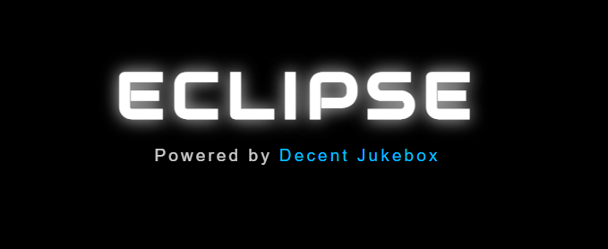
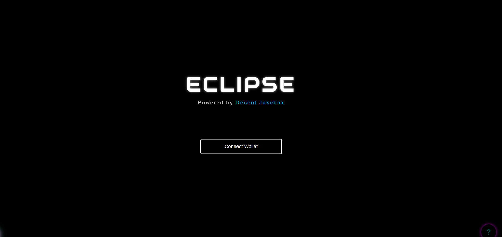
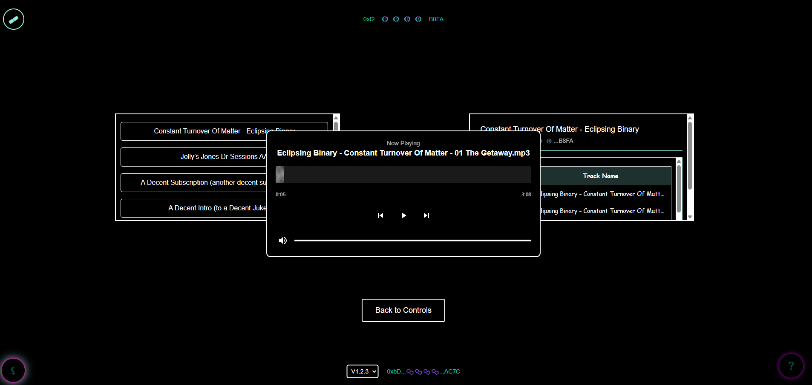
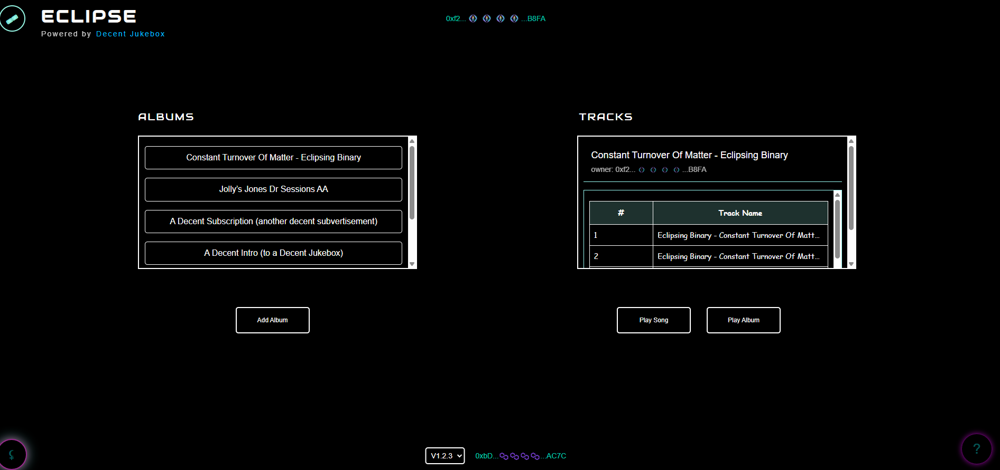

# ECLIPSE

    
    
A Modern Web3 Jukebox Experience powered by <a href="https://github.com/TheJollyLaMa/JollyJukeBox">Decent Jukebox</a>

## 🎵 Features

- **Minimalist Black & White Interface**: Clean, modern design focused on the music experience
- **Multi-Gateway IPFS Support**: Reliable playback through multiple IPFS gateways
- **Custom Audio Player**:
  - Animated waveform progress visualization
  - Intuitive playback controls
  - Real-time progress tracking
  - Volume control with visual feedback
- **Web3 Integration**:
  - Seamless wallet connection
  - Multiple token support
  - Transparent blockchain transactions
- **Responsive Design**: Optimized for various screen sizes

## 🎮 Interface

### Landing Page

- Clean, minimalist black background
- Glowing "ECLIPSE" title in modern Audiowide font
- "Powered by Decent Jukebox" subtitle with link
- Centered "Connect Wallet" button with elegant border styling

### Music Player

- Custom-designed audio player with waveform visualization
- Intuitive controls for play/pause, track progress, and volume
- Clean layout with optimal visibility

### Album Selection

- Dual LCD display interface
- Clear album and track listings
- Easy navigation between controls

## 🚀 Getting Started

1. Visit [ECLIPSE Jukebox](https://eclipsingbinary.github.io/ECLIPSEJukeBox/public/)
2. Connect your Web3 wallet (MetaMask recommended)
3. Browse and select from available albums
4. Choose your preferred payment token
5. Enjoy the music!

## 💻 Technical Features

- **Multiple IPFS Gateway Support**:
  - Web3.Storage
  - IPFS.io
  - Cloudflare IPFS
  - Pinata Gateway
- **Smart Contract Integration**:
  - Polygon Network support
  - Multiple token payment options
  - Transparent fee structure

## 🔧 Development

ECLIPSE is built on top of the [Decent Jukebox](https://github.com/TheJollyLaMa/JollyJukeBox) platform, enhancing it with:
- Modern UI/UX design principles
- Improved playback reliability
- Enhanced visual feedback
- Streamlined user interactions

## 📄 Contract Information

- [Decent JukeBox V1.2.3 on Polygon](https://polygonscan.com/address/0xACB7850f5836fD9981c7d01F2Ca64628a661f287)
- [Previous Versions](https://github.com/TheJollyLaMa/JollyJukeBox)

## 🤝 Contributing

Contributions are welcome! Please feel free to submit a Pull Request. For major changes, please open an issue first to discuss what you would like to change.

## 📞 Contact

For questions or suggestions, reach out to us:
- GitHub Issues: [Open an issue](https://github.com/eclipsingbinary/ECLIPSEJukeBox/issues)
- Email: [contact@eclipse.com](mailto:contact@eclipse.com)

## 🙏 Credits

- Built on [Decent Jukebox](https://github.com/TheJollyLaMa/JollyJukeBox)
- UI/UX Design: ECLIPSE Team
- Smart Contract: Decent Agency

     
    
    
    
    
     
    
Keep Your Music Decent!

